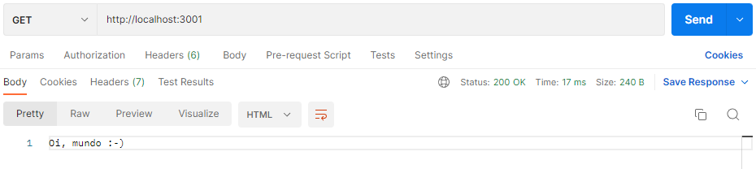
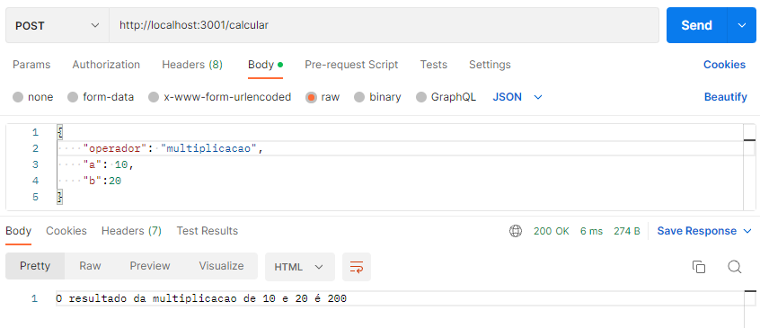

# 📝 Entregavel 3 - Ambientes de Desenvolvimento de Software

Repositório para armazenar os códigos do Entregável 3 da disciplina Ambientes de Desenvolvimento de Software.

O entregável pede que seja construído um servidor express com dois endpoints, "/" e "/soma", os quais devem ser testados via Postman

# 📈 Tutorial para uso

### Preparação do ambiente

- Baixar os códigos contidos nesse repositórios para a sua máquina
- Executar no terminal o comando

```Text Bash
npm install
```

- Após instalar todos os pacotes, coloque o servidor para rodar com o comando

```Text Bash
node app.js
```


### Primeira Requisição

- Abrir o Postman
- Adicionar um request
- Colocar o método GET
- Adicionar na URL do request <http://localhost:3001>
- Clicar send



## Segunda Requisição

- Abrir o Postman
- Adicionar um request
- Colocar o método POST
- Adicionar na URL do request <http://localhost:3001/soma>
- Clicar em Body
- Selecionar a opção "raw"
- Colocar o json no body

```Text JSON
{
    "a": 10,
    "b":20
}
```

- Clicar em enviar
